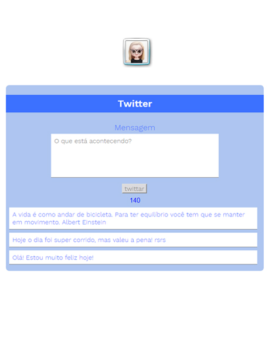

# Twitter
## Objetivo do projeto
Este projeto foi proposto pela Laboratória durante o bootcamp de 2019.

O objetivo desse desafio é replicar o feed de notícias do Twitter, tendo os itens abaixo como requisitos.
A adaptação do design é livre.

# Requisitos

- Um formulário que permita inserir um texto e um botão para "twittar".
- O texto digitado deve ser inserido no HTML.
- O botão twittar deve ficar desativado se não houver texto ou se o texto ultrapassar 140 caracteres.
- Um contador regressivo que mostre o quantidade de caracteres.
- Alteração na cor do contador quando ultrapassar 120 e 130 caracteres.
- Contador negativo quando ultrapassar 140 caracteres.

# Layout

